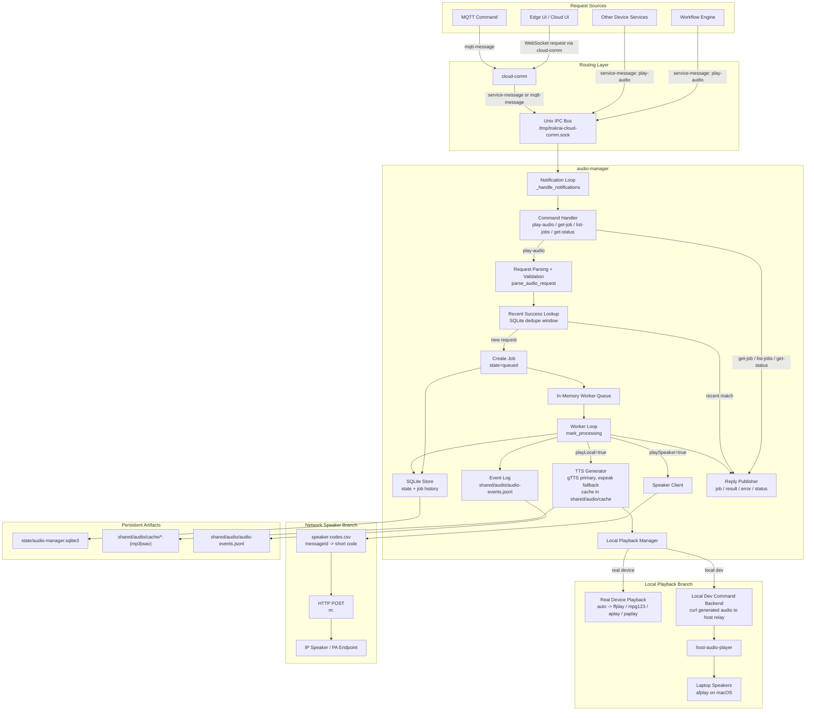

# Audio Service Flow

This document describes the complete request, execution, and delivery path for `trakrai-audio-manager`.

## End-To-End Flow

## Response Semantics

- `play-audio` returns an immediate `audio-manager-job` response after queueing or deduping.
- Worker completion later emits `audio-manager-result`.
- Validation, queue overflow, or delivery failures emit `audio-manager-error`.
- `get-job`, `list-jobs`, and `get-status` are read-only IPC commands handled without going through the worker queue.

## Key Runtime Branches

- `playLocal=true`:
  - synthesize text into a cached audio file
  - run the configured playback backend
  - mark `localState`
- `playSpeaker=true`:
  - resolve `speakerCode` directly or through `speakerMessageId`
  - POST the short code or JSON payload to the configured speaker endpoint
  - mark `speakerState`
- both can run for the same job, and the final job state is persisted only after both branches finish

## Local Dev Specifics

- The device container still generates the audio file.
- The device container now tries `gTTS` first and falls back to `espeak`.
- The local dev config overrides playback to a `command` backend that sends the generated audio file to `host-audio-player`.
- `host-audio-player` plays the file on the host machine and records the last playback request under `.localdev/host-audio-player`.

## Files To Inspect

- Service loop: `device/python/audio_manager/src/service.py`
- TTS backend selection: `device/python/audio_manager/src/tts.py`
- Playback backend selection: `device/python/audio_manager/src/playback.py`
- Network speaker delivery: `device/python/audio_manager/src/speaker.py`
- Local host relay: `device/localdev/host-audio-player/server.py`
- Local verifier: `python3 -m device.devtool test run --test-name audio-service-local`
