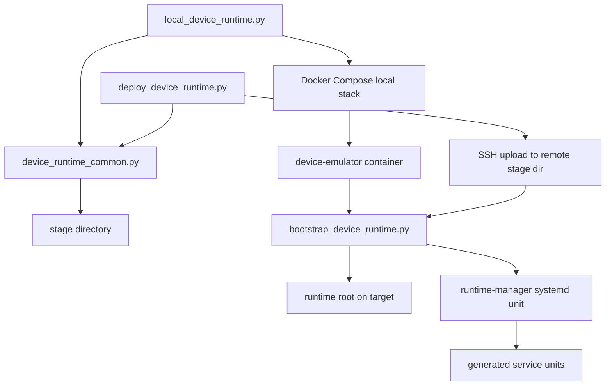
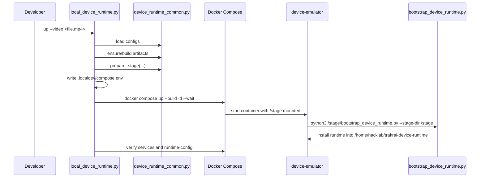

# Device Runtime Bring-Up Scripts

This page explains how the Python bring-up scripts under `device/scripts/` work together.

It is intended for maintainers who need to understand:

- how the local Docker-based device emulator is started
- how a real Linux device is staged and deployed over SSH
- how the staged runtime layout is generated
- how the final install on the target machine is applied

Out of scope:

- verification-only scripts such as `verify_cloud_transfer_local.py`
- the internals of the Go services themselves
- UI package internals beyond the fact that a static export is staged

## Scripts Covered

- `device_runtime_common.py`
- `local_device_runtime.py`
- `deploy_device_runtime.py`
- `bootstrap_device_runtime.py`
- `update_control_plane.py` (runs on the target device, not the controller)

## One-Sentence Model

`device_runtime_common.py` builds a staged runtime payload, `local_device_runtime.py` delivers that payload into a Docker-based fake device, `deploy_device_runtime.py` delivers the same payload to a real device over SSH, and `bootstrap_device_runtime.py` is the installer that applies the staged payload on the target Linux filesystem.

## The Shared Deployment Model

Both local bring-up and real-device deployment use the same four concepts:

1. Build or reuse runtime artifacts under `device/out/`.
2. Load a config set such as `cloud-comm.json`, `cloud-transfer.json`, and `live-feed.json`.
3. Generate a stage directory containing binaries, configs, UI zip, optional Python wheels, and a manifest.
4. Run `bootstrap_device_runtime.py` against that stage directory on the target environment.

That means the local emulator is not a separate implementation. It is the same staged runtime, just installed into a Docker container instead of a Jetson or other Linux edge device.

## Script Relationship



## What `device_runtime_common.py` Does

`device_runtime_common.py` is the source of truth for the bring-up payload. It is not an entrypoint on its own; it is the shared library used by both `local_device_runtime.py` and `deploy_device_runtime.py`.

### Main responsibilities

- define which services are built as artifacts
- load JSON config files from a directory
- make sure compiled binaries exist in `device/out/`
- make sure the static edge UI export exists in `web/apps/trakrai-device/out`
- create the staging directory layout
- patch `cloud-comm.json` with edge HTTP/UI settings for the target environment
- generate `runtime-manager.json` and `managed-services.json`
- generate `manifest.json`, which is what the bootstrap script consumes

### Important functions

`ensure_local_artifacts(...)`

- resolves the expected binaries under `device/out/<service>/<service>`
- optionally runs Docker buildx to rebuild them
- optionally resolves the AI inference wheel
- ensures the static edge UI export exists

`build_device_artifacts(...)`

- runs one Docker build per service target
- uses normal `Dockerfile` for most services
- uses `Dockerfile.gstreamer` for `live-feed` and `rtsp-feeder`
- uses `Dockerfile.wheel` for the optional AI inference wheel

`prepare_stage(...)`

- creates `binaries/`, `configs/`, `ui/`, and `wheels/` inside the stage dir
- deep-copies the config map and patches `cloud-comm.json`
- copies each required binary into `binaries/`
- zips the static device UI into `ui/trakrai-device-ui.zip`
- writes generated runtime-manager state/config files
- writes `manifest.json`

`build_runtime_manager_config(...)`

- describes managed services for `runtime-manager`
- always includes `cloud-comm`, `runtime-manager`, and the static `edge-ui`
- conditionally includes `cloud-transfer`, `live-feed`, `ptz-control`, `rtsp-feeder`, and AI inference based on available configs

`build_manifest(...)`

- defines the runtime root, directories, files to install, and wheel setup commands
- defines which systemd units must be stopped before install
- defines which units the bootstrap script waits for and verifies afterward
- controls whether the deployment is `core` only or `all`

### Stage directory contents

The shared stage layout looks like this:

```text
<stage>/
  binaries/
    cloud-comm
    cloud-transfer
    live-feed
    ptz-control
    rtsp-feeder
    runtime-manager
  configs/
    cloud-comm.json
    runtime-manager.json
    managed-services.json
    ...
  ui/
    trakrai-device-ui.zip
  wheels/
    <optional ai wheel>
  manifest.json
```

`bootstrap_device_runtime.py` relies on `manifest.json` rather than hardcoding what to install.

When that stage is installed on the target runtime, the files land like this:

```text
<runtime-root>/
  bin/
  configs/
    cloud-comm.json
    runtime-manager.json
    cloud-transfer.json
    ...
  downloads/
  logs/
  scripts/
  shared/
  state/
    managed-services.json
  ui/
  versions/
```

## What `local_device_runtime.py` Does

`local_device_runtime.py` is the local developer entrypoint. It stages the runtime and then starts a Docker Compose stack that treats a container as the device.

### Commands

- `up`
- `down`
- `status`
- `logs`

### `up` flow



### Local-only responsibilities

- validates the MP4 path used by the fake RTSP camera
- patches selected local config values such as:
  - MQTT broker host and port
  - device ID
  - local WebRTC host candidate and UDP port range
- creates `.localdev/stage`
- writes `.localdev/compose.env`
- starts the local services:
  - `device-emulator`
  - `fake-camera`
  - `redis`
  - `minio`
- verifies the stack after startup

### Important implementation details

The local script intentionally uses the same stage payload as real deployment. The only difference is delivery:

- real deployment uploads the stage to a remote Linux host
- local deployment bind-mounts the stage into the `device-emulator` container as `/stage`

The `device-emulator` entrypoint then runs:

```bash
python3 /stage/bootstrap_device_runtime.py --stage-dir /stage
```

That is why local emulation exercises the same bootstrap logic as the real device path.

### Generated local files

The local script owns these generated paths:

- `device/.localdev/stage/`
- `device/.localdev/compose.env`
- `device/.localdev/shared/`

The host-backed shared directory is especially important for `cloud-transfer`, because uploads and downloads in the local UI are expected to use paths relative to that directory.

## What `deploy_device_runtime.py` Does

`deploy_device_runtime.py` is the real-device deployment entrypoint. It prepares the same stage payload locally, uploads it to a remote stage directory over SSH/SFTP, and then runs the bootstrap script on the target using `sudo`.

### Main flow

1. Parse deployment arguments such as `--host`, `--user`, `--password`, `--runtime-root`, and `--transport-mode`.
2. Load configs:
   - from `--config-dir` if provided
   - otherwise by fetching JSON config files from the current remote runtime root over SFTP
3. Resolve artifacts:
   - by default, build or reuse local artifacts via `device_runtime_common.ensure_local_artifacts(...)`
   - with `--artifact-source cloud`, download published artifacts from the cloud package repository using the device credentials from `cloud-transfer.json` (or explicit CLI overrides)
4. Create a temporary local stage directory and call `prepare_stage(...)`.
5. Open SSH to the target device.
6. Create a remote stage directory such as `/tmp/trakrai-bootstrap-<timestamp>`.
7. Upload the entire local stage tree.
8. Upload `bootstrap_device_runtime.py` separately next to that stage.
9. Execute the bootstrap script remotely via:

```text
echo <password> | sudo -S python3 <remote-stage>/bootstrap_device_runtime.py --stage-dir <remote-stage>
```

10. Run a post-deploy verification command over SSH.
11. Remove the remote stage directory unless `--keep-stage` was requested.

### Why configs are fetched from the device by default

If `--config-dir` is omitted, the deploy script treats the device’s current runtime config as the source of truth and reuses it. That keeps deploys aligned with whatever service mix and config values already exist on the target device.

### Cloud artifact mode

When `--artifact-source cloud` is used, the deploy script does not require prebuilt `device/out/*` binaries or a fresh UI export. Instead it:

- determines the required package set from the loaded device configs
- reads package versions from `device/package-versions.json`
- requests package download sessions from the real cloud API using the device `cloud-transfer` credentials
- downloads those published artifacts locally and stages them for the same bootstrap flow

This is intended for the fast path where CI has already built and published the release packages and the controller machine only needs to fetch and deploy them.

Notes on the cloud path:

- `download_release_artifacts` returns a `{package-name: Path}` map. Package names for wheels are the `service_name` (e.g. `audio-manager`, `trakrai-ai-inference`, `workflow-engine`). `prepare_stage` looks wheels up by `PythonWheelTarget.artifact_key` (e.g. `audio-manager-wheel`, `ai-wheel`, `workflow-engine-wheel`), so the deploy script mirrors each wheel entry under its `artifact_key` before calling `prepare_stage`.
- Wheelhouse deps for services that set `build_wheelhouse=True` are resolved on the controller with `pip download --only-binary=:all: --platform manylinux*/linux_aarch64 --python-version 38 --implementation cp`, so the downloaded dependency wheels are valid for the target device (linux/arm64 by default), not the controller's own architecture.
- `--cloud-bridge-url` defaults to empty. When empty, the edge UI's `cloud_bridge_url` is preserved from the existing runtime-config on the device (or generated as `ws://<host>:<http-port>/ws` on a fresh install), so deploys do not silently overwrite the cloud bridge with the old hard-coded VPN host.

### Remote verification behavior

After bootstrap completes, the script checks:

- active `trakrai-*` systemd units
- runtime-root directory contents
- installed binaries
- logs directory
- versions directory
- generated unit files in `/etc/systemd/system`

This is a coarse post-deploy sanity check, not a functional acceptance test.

`bootstrap_device_runtime.verify_units` waits up to 20 seconds for any unit that reports `activating` or `reloading` to settle into `active` before declaring failure. That avoids spurious "unit verification failed" errors when a service depends on a slow IPC peer during cold start (e.g. `ptz-control` probing ONVIF cameras on a fresh power-up).

## What `bootstrap_device_runtime.py` Does

`bootstrap_device_runtime.py` is the actual installer. It runs on the target Linux environment and applies the contents of the stage directory to the target runtime root and systemd unit directory.

It must run as root.

### Inputs

- `--stage-dir`
- optional `--manifest` name, defaulting to `manifest.json`

### Bootstrap sequence

1. Read and parse the manifest from the stage directory.
2. Resolve runtime metadata such as:
   - runtime root
   - runtime user and group
   - systemd unit directory
3. Create the runtime root if needed.
4. Stop and disable units listed in `stop_units`.
5. Kill manually launched legacy processes listed in `manual_process_patterns`.
6. Move legacy runtime files into a timestamped backup directory under `legacy-backups/`.
7. Create required runtime directories such as:
   - `bin`
   - `downloads`
   - `logs`
   - `scripts`
   - `shared`
   - `state`
   - `ui`
   - `versions`
8. Copy config files from the stage into the runtime root.
9. Copy binaries into the runtime root and apply file modes.
10. Unzip the static UI bundle into `<runtime-root>/ui`.
11. Copy optional wheels into `<runtime-root>/downloads` and run their install commands.
12. Write the runtime-manager wrapper script that records version information and launches the manager binary.
13. Write the systemd unit for `trakrai-runtime-manager.service`.
14. Run `systemctl daemon-reload`.
15. Enable and restart the runtime manager.
16. Wait for the runtime manager to become active.
17. Wait for dynamically generated unit files to appear.
18. Start the configured service units.
19. Verify units listed in `verify_units`.
20. Recursively chown the runtime root back to the configured runtime user/group.

### Why runtime-manager is special

The bootstrap script only writes one systemd unit directly: `trakrai-runtime-manager.service`.

Everything else is described in `configs/runtime-manager.json`, and `runtime-manager` is responsible for materializing and controlling the remaining service units. That is why bootstrap waits for generated units after starting the runtime manager.

## Local Vs Real Deployment

The following table is the practical difference between the two entrypoints:

| Concern | `local_device_runtime.py` | `deploy_device_runtime.py` |
| --- | --- | --- |
| Target | Docker container on the developer machine | Real Linux device over SSH |
| Stage location | `device/.localdev/stage` | Local temp dir, then uploaded to remote temp dir |
| Config source | Local config dir, defaulting to `device/localdev/configs` | Local config dir or fetched from the device |
| Artifact platform | Host-native local platform by default | `linux/arm64` by default |
| Bootstrap executor | Container entrypoint | Remote `sudo python3` command |
| Extra infrastructure | fake camera, Redis, MinIO, mock cloud API | none |
| Post-start verification | Compose health + service checks + runtime-config | SSH sanity listing of units/files |

## Runtime Data Hand-Off

The manifest-driven hand-off between scripts is the core contract:

- `device_runtime_common.py` decides what should exist
- `manifest.json` serializes that decision
- `bootstrap_device_runtime.py` applies it exactly

That separation matters because it keeps install logic declarative:

- the stage generator is responsible for composing payloads
- the bootstrap installer is responsible for applying payloads

## Practical Debugging Notes

### If local bring-up fails

Check, in order:

1. `device/out/` contains the expected binaries.
2. `web/apps/trakrai-device/out` exists, or allow the local script to build it.
3. `.localdev/compose.env` contains the expected ports and stage paths.
4. `docker compose ... ps` shows `device-emulator` healthy.
5. container logs show `bootstrap_device_runtime.py` completed.

### If remote deployment fails

Check, in order:

1. SSH connectivity and `sudo` password validity.
2. the remote runtime user and group names exist on the device.
3. the selected runtime root and unit directory are writable by root.
4. the remote device has Python 3 and systemd available.
5. the remote stage directory is preserved with `--keep-stage` so the manifest and copied files can be inspected.

### If a service is missing after bootstrap

That usually means one of these:

- its config file was not present in the loaded config map, so `device_runtime_common.py` did not include it
- its artifact was missing under `device/out/`
- `runtime-manager` could not materialize or start the generated unit

## Which Script To Modify

Use this rule of thumb:

- change `device_runtime_common.py` if the stage contents, runtime-manager config, manifest, or shared deployment rules should change
- change `local_device_runtime.py` if the local emulator workflow, Compose env, or local-only config patching should change
- change `deploy_device_runtime.py` if the SSH delivery path, remote config loading, or remote verification should change
- change `bootstrap_device_runtime.py` if the target-machine install sequence itself should change

## Summary

The bring-up pipeline is intentionally split into:

- a shared stage generator
- two delivery entrypoints
- one installer

That keeps local emulation and real deployment aligned. If the staged payload is correct and `bootstrap_device_runtime.py` works, both bring-up paths should converge on the same runtime layout and managed-service behavior.

## Updating runtime-manager and cloud-comm in place

`runtime-manager` and `cloud-comm` together are the control plane for every other service on the device. They cannot update themselves through the managed-service update path the other services use, because that path is driven by `runtime-manager` itself and would be pulling the rug out from under the running process.

`update_control_plane.py` is the escape hatch for that class of update. It runs on the device (as root), reads the device's own `cloud-transfer.json` to authenticate against the cloud package API, downloads a published binary, verifies its SHA-256, installs it into `<runtime-root>/bin/<package>`, writes `<runtime-root>/versions/<package>.txt`, and restarts the associated systemd unit. It is stdlib-only so it runs on a bare Jetson image with no repo checkout.

`bootstrap_device_runtime.py` stages it during every deploy via the manifest's `tools` section:

- `<runtime-root>/scripts/update_control_plane.py` — the script itself (`0755`).
- `<runtime-root>/state/package-versions.json` — a snapshot of `device/package-versions.json` taken at deploy time, which the script reads to resolve the target version, `remotePath`, and expected SHA-256. Marked optional so a first-time deploy before any release publish does not fail.

Typical on-device usage once a new build has been published by CI:

```
sudo python3 /home/hacklab/trakrai-device-runtime/scripts/update_control_plane.py
# or scope to one package
sudo python3 /home/hacklab/trakrai-device-runtime/scripts/update_control_plane.py --packages runtime-manager
# or pull a fresh manifest (e.g. committed by the Publish Device Packages workflow)
sudo python3 /home/hacklab/trakrai-device-runtime/scripts/update_control_plane.py \
    --metadata-url https://ai.trakr.live/device-packages/package-versions.json
```

By default the script updates both `runtime-manager` and `cloud-comm` on `linux/arm64`. `--dry-run` prints the plan without downloading; `--skip-restart` installs binaries without touching systemd; `--metadata-path` and `--metadata-url` override where the script looks for release metadata.

The script does **not** touch configs, service unit files, wheels, the UI bundle, or any other managed service. For changes to those, use `deploy_device_runtime.py` from the controller as before.
