# Permission Management And OpenFGA Flow

This document is the current source of truth for how permission management works in TrakrAI.

It describes the setup that is implemented now:

- Better Auth owns identity and the global sysadmin role.
- Postgres owns application records such as factories, departments, devices, app catalog entries, and per-device app installations.
- OpenFGA owns the hierarchy graph and all scoped authorization tuples.
- The app writes targeted OpenFGA tuples during create/update/assignment operations.
- The app does **not** run a database-to-OpenFGA sync loop.

## 1. Ownership Boundaries

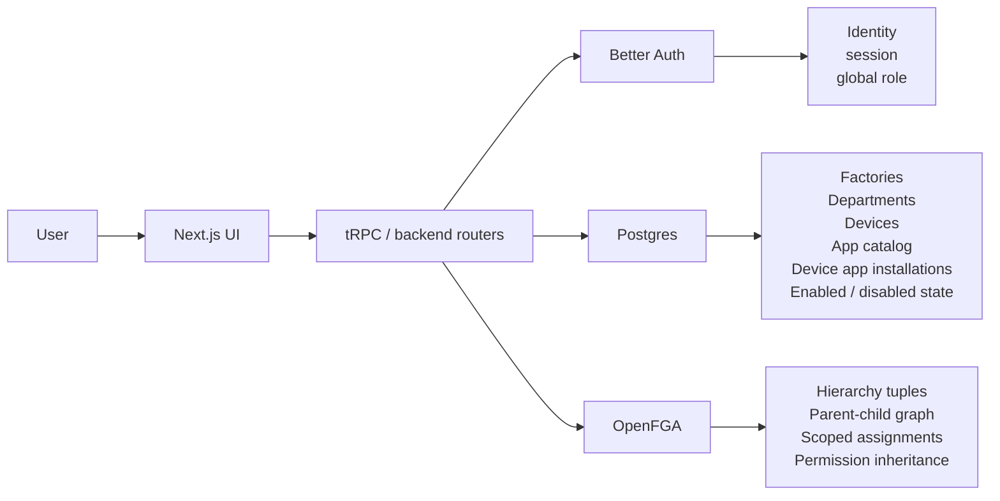

### Important rule

OpenFGA is the source of truth for access control.

Postgres stores app data that the product needs for rendering and operations, but it is not the source of truth for scope inheritance or user authorization.

## 2. Core Object Hierarchy

There is no `headquarter` object in the current system.

The hierarchy starts at `factory`.

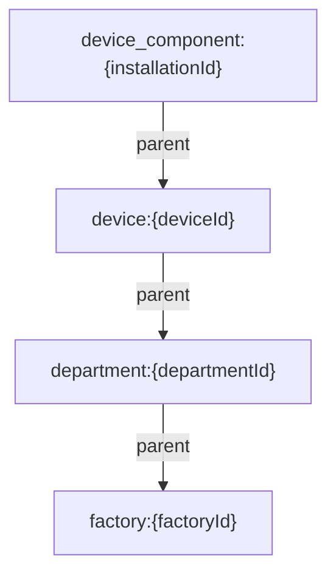

### Why `device_component` uses installation id

OpenFGA stores permissions on the installed app record for a specific device, not on the global app catalog entry.

That means:

- one app installed on two devices becomes two separate `device_component` objects in OpenFGA
- each installation can have different user assignments
- the enabled/disabled switch remains per installation in Postgres

## 3. Direct Relations By Object Type

These are the direct relations currently modeled in OpenFGA.

| Object type        | Direct relations             | Meaning                                              |
| ------------------ | ---------------------------- | ---------------------------------------------------- |
| `factory`          | `admin`, `viewer`            | top-level scope assignment                           |
| `department`       | `parent`, `admin`, `viewer`  | child of factory, optional direct scoped assignments |
| `device`           | `parent`, `viewer`           | child of department, readable assignment point       |
| `device_component` | `parent`, `reader`, `writer` | installed app on a device                            |

### Important non-features

- `device` does **not** have a direct `admin` relation
- `device_component` does **not** have a direct `admin` or `viewer` relation
- sysadmin is **not** stored in OpenFGA

Sysadmin is a Better Auth concept. The app treats a Better Auth role containing `admin` as sysadmin and grants global control in backend logic.

## 4. Effective Permissions And Inheritance

This diagram shows the computed relations from the OpenFGA authorization model.

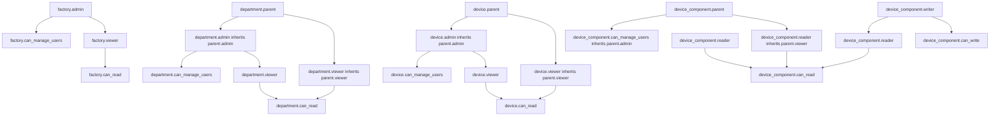

## 5. Effective Permission Matrix

### Factory scope

- `factory.admin`
  - can manage users in that factory
  - becomes inherited admin for all departments under that factory
  - becomes inherited admin for all devices under those departments
  - becomes `can_manage_users` for all device app installations under those devices
  - also reads the whole subtree because `admin` is included in `viewer`
- `factory.viewer`
  - can read that factory subtree
  - inherited downward as viewer to departments and devices
  - inherited to device app installations as component reader

### Department scope

- `department.admin`
  - can manage users in that department subtree
  - inherited as admin to child devices
  - inherited as `can_manage_users` to installed apps under those devices
  - also reads downward because admin is included in viewer
- `department.viewer`
  - can read that department subtree
  - inherited as viewer to child devices
  - inherited as component reader to installed apps under those devices

### Device scope

- `device.viewer`
  - can read that device
  - automatically reads all installed apps under that device through component reader inheritance
  - does **not** gain manage-users power by itself

### Device app scope

- `device_component.reader`
  - can read one installed app
- `device_component.writer`
  - can write one installed app
  - also implies read on that installed app

## 6. Sysadmin Model

Sysadmin is handled outside OpenFGA.

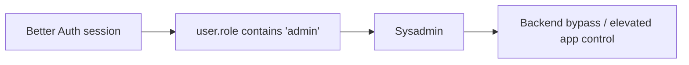

### Sysadmin powers

- create and update factories
- create and update departments
- create and update app catalog entries
- enable or disable app installations on devices
- create users through Better Auth admin flows
- assign scoped relations at all supported scopes
- access sysadmin-only management pages

OpenFGA still stores the hierarchy and scoped assignments for non-sysadmin access, but sysadmin itself is not represented as a graph relation.

## 7. Write Flow: Hierarchy Setup

Hierarchy writes are targeted tuple writes. There is no whole-database synchronization pass.

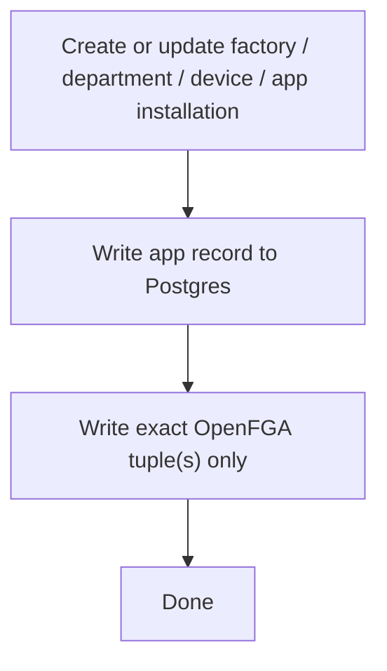

### Actual write behavior

- Create factory
  - Postgres inserts factory row
  - no parent tuple needed because factory is the root scope
- Create or update department
  - Postgres writes department row
  - backend writes exactly one `department -> parent -> factory` tuple
- Create device
  - Postgres writes device row
  - device parent tuple is maintained for the department scope
- Create app installation
  - Postgres writes `device_component_installation` row
  - backend writes exactly one `device_component -> parent -> device` tuple
- Enable / disable app installation
  - Postgres updates `enabled`
  - no hierarchy sync is needed

## 8. Write Flow: User Assignment

Assignments are modeled as direct user-to-object tuples.

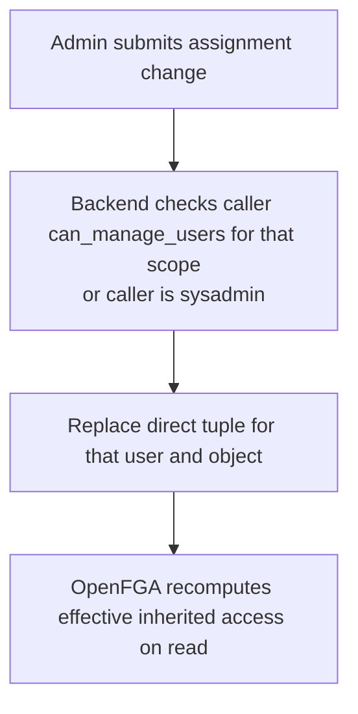

### Supported direct assignment types

| Scope                   | Allowed direct relations |
| ----------------------- | ------------------------ |
| Factory                 | `admin`, `viewer`        |
| Department              | `admin`, `viewer`        |
| Device                  | `viewer`                 |
| Device app installation | `reader`, `writer`       |

### Example

If user `alice` gets `factory.admin` on `factory:factory-01`, the backend writes only:

```text
user:alice#admin@factory:factory-01
```

OpenFGA handles the rest at check time:

- `department` admin under that factory
- `device` admin under those departments
- `device_component` manage-users under those devices
- read access through inherited viewer/reader rules

## 9. Read Flow: Access-Control Pages

The new access-control pages do not load the whole world.

They use paginated, scope-specific server queries and OpenFGA checks.

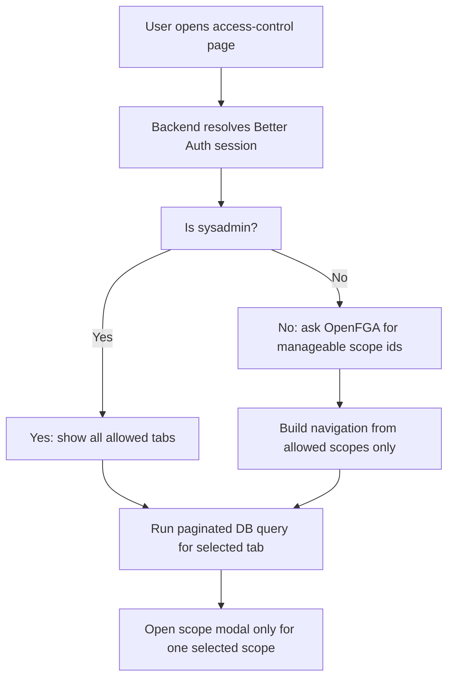

### Key optimization

The UI does not fetch a global management console payload anymore.

Instead it uses:

- paginated DB queries for table rows
- OpenFGA `listObjects` for manageable scope discovery
- single-scope assignment reads when a modal opens

## 10. Read Flow: Device Workspace And App Access

Device app availability depends on both database state and OpenFGA permission.

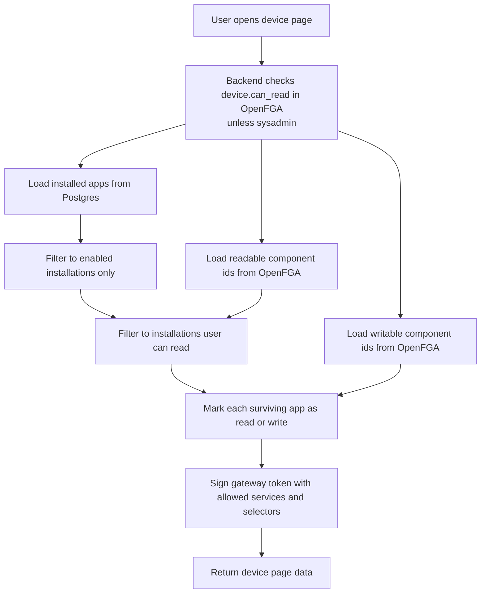

### Important rule

Even if a user has `reader` or `writer` in OpenFGA, a disabled installation is still hidden and unusable.

Access requires both:

- installation is `enabled = true` in Postgres
- user has readable or writable permission in OpenFGA

## 11. Example End-To-End Scenarios

### Scenario A: Factory admin

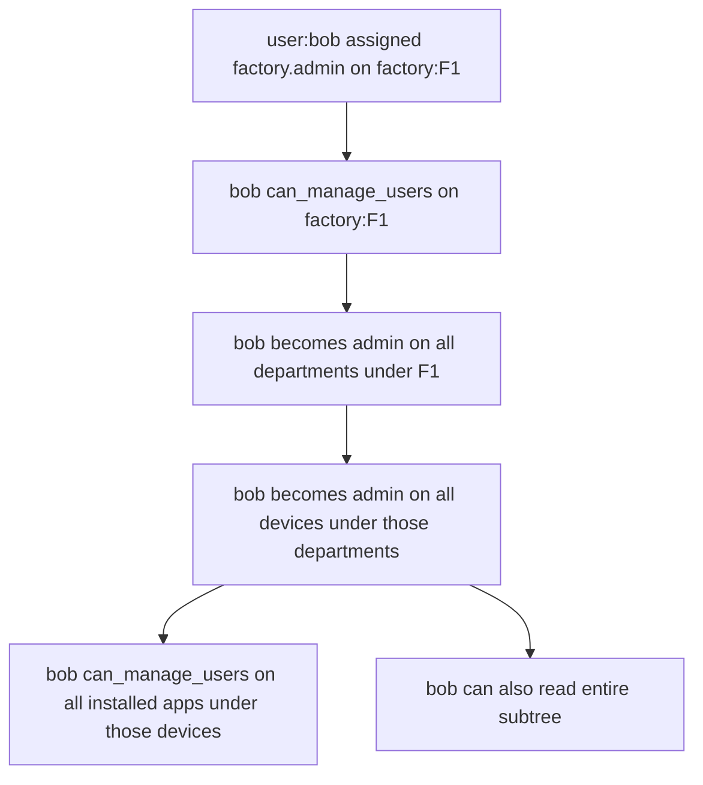

### Scenario B: Department viewer

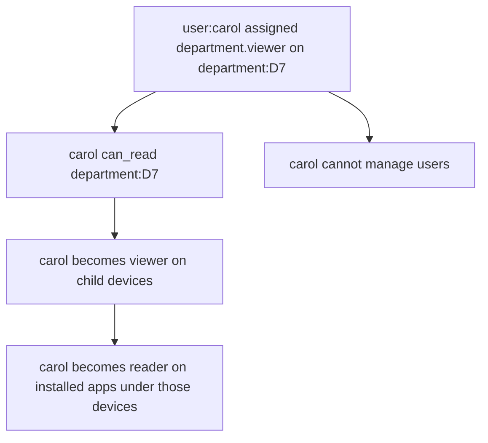

### Scenario C: App writer on one device

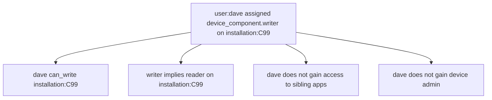

## 12. Current Design Constraints

- No `headquarter` layer
- No default factory or default department
- No DB-to-OpenFGA sync job
- No full auth graph rebuild on each write
- No hardcoded app permissions in auth code
- Device apps are registered from catalog and installation records
- Sysadmin is Better Auth based, not OpenFGA based

## 13. Source Files

These files define the current behavior described above:

- `web/packages/core/trakrai-backend/src/lib/authz/model.ts`
- `web/packages/core/trakrai-backend/src/lib/authz/constants.ts`
- `web/packages/core/trakrai-backend/src/lib/authz/relations.ts`
- `web/packages/core/trakrai-backend/src/lib/authz/mutations.ts`
- `web/packages/core/trakrai-backend/src/lib/authz/openfga-state.ts`
- `web/packages/core/trakrai-backend/src/lib/authz/device-access.ts`
- `web/packages/core/trakrai-backend/src/server/routers/access-control/router.ts`
- `web/packages/core/trakrai-backend/src/server/routers/access-control/queries.ts`
